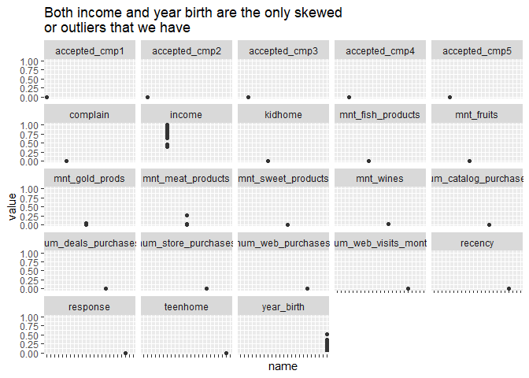
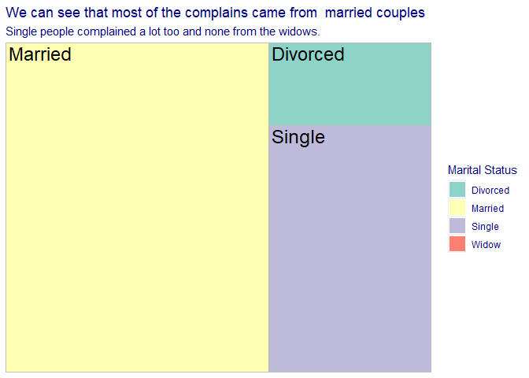

Marketing Campaign Analysis
================
Elegushi Adetunji
10/11/2021

# **Introduction**

This is a descriptive analysis specifically, recent marketing campaigns
have not been as effective as they were expected to be.

We will be analyzing the data set to understand the problems and propose
data-driven solutions.

From the columns (variables) given, there will be some obvious questions
that will be answered during the analysis such as:

-   Which products are performing best?

-   Which channels are underperforming?

-   Which marketing campaign is most successful?

-   What does the average customer look like for this company?

-   Which countries are the customers from and the country that buys the
    most??

Some questions also will be revealed during the analysis which are not
obvious right now

------------------------------------------------------------------------

\#1. **Exploratory Data Analysis**

In order to be able to answer and get accustomed to the data, we will be
investigating our data like a detective who wants to catch a muderer. we
will be exploring the data in order to find out and answer the questions
below:

-   Are there any null values or outliers? How will you wrangle/handle
    them?

-   Are there any variables that warrant transformations?

-   Are there any useful variables that you can engineer with the given
    data?

-   Do you notice any patterns or anomalies in the data? Can you plot
    them?

The next step will be to load and get a quick look at the data we will
be dealing with,and clean up the data for further analysis.

``` r
market_data <-read_csv("marketing_data.csv",show_col_types = FALSE) %>%
clean_names() %>% 
mutate(income = parse_number(income)) %>% 
  mutate(dt_customer=as_date(dt_customer,format = "%m/%d/%y"))
skimr::skim(market_data)
```

|                                                  |              |
|:-------------------------------------------------|:-------------|
| Name                                             | market\_data |
| Number of rows                                   | 2240         |
| Number of columns                                | 28           |
| \_\_\_\_\_\_\_\_\_\_\_\_\_\_\_\_\_\_\_\_\_\_\_   |              |
| Column type frequency:                           |              |
| character                                        | 3            |
| Date                                             | 1            |
| numeric                                          | 24           |
| \_\_\_\_\_\_\_\_\_\_\_\_\_\_\_\_\_\_\_\_\_\_\_\_ |              |
| Group variables                                  | None         |

Data summary

**Variable type: character**

| skim\_variable  | n\_missing | complete\_rate | min | max | empty | n\_unique | whitespace |
|:----------------|-----------:|---------------:|----:|----:|------:|----------:|-----------:|
| education       |          0 |              1 |   3 |  10 |     0 |         5 |          0 |
| marital\_status |          0 |              1 |   4 |   8 |     0 |         8 |          0 |
| country         |          0 |              1 |   2 |   3 |     0 |         8 |          0 |

**Variable type: Date**

| skim\_variable | n\_missing | complete\_rate | min        | max        | median     | n\_unique |
|:---------------|-----------:|---------------:|:-----------|:-----------|:-----------|----------:|
| dt\_customer   |          0 |              1 | 2012-07-30 | 2014-06-29 | 2013-07-08 |       663 |

**Variable type: numeric**

| skim\_variable          | n\_missing | complete\_rate |     mean |       sd |   p0 |      p25 |     p50 |      p75 |   p100 | hist  |
|:------------------------|-----------:|---------------:|---------:|---------:|-----:|---------:|--------:|---------:|-------:|:------|
| id                      |          0 |           1.00 |  5592.16 |  3246.66 |    0 |  2828.25 |  5458.5 |  8427.75 |  11191 | ▇▇▇▇▇ |
| year\_birth             |          0 |           1.00 |  1968.81 |    11.98 | 1893 |  1959.00 |  1970.0 |  1977.00 |   1996 | ▁▁▂▇▅ |
| income                  |         24 |           0.99 | 52247.25 | 25173.08 | 1730 | 35303.00 | 51381.5 | 68522.00 | 666666 | ▇▁▁▁▁ |
| kidhome                 |          0 |           1.00 |     0.44 |     0.54 |    0 |     0.00 |     0.0 |     1.00 |      2 | ▇▁▆▁▁ |
| teenhome                |          0 |           1.00 |     0.51 |     0.54 |    0 |     0.00 |     0.0 |     1.00 |      2 | ▇▁▇▁▁ |
| recency                 |          0 |           1.00 |    49.11 |    28.96 |    0 |    24.00 |    49.0 |    74.00 |     99 | ▇▇▇▇▇ |
| mnt\_wines              |          0 |           1.00 |   303.94 |   336.60 |    0 |    23.75 |   173.5 |   504.25 |   1493 | ▇▂▂▁▁ |
| mnt\_fruits             |          0 |           1.00 |    26.30 |    39.77 |    0 |     1.00 |     8.0 |    33.00 |    199 | ▇▁▁▁▁ |
| mnt\_meat\_products     |          0 |           1.00 |   166.95 |   225.72 |    0 |    16.00 |    67.0 |   232.00 |   1725 | ▇▁▁▁▁ |
| mnt\_fish\_products     |          0 |           1.00 |    37.53 |    54.63 |    0 |     3.00 |    12.0 |    50.00 |    259 | ▇▁▁▁▁ |
| mnt\_sweet\_products    |          0 |           1.00 |    27.06 |    41.28 |    0 |     1.00 |     8.0 |    33.00 |    263 | ▇▁▁▁▁ |
| mnt\_gold\_prods        |          0 |           1.00 |    44.02 |    52.17 |    0 |     9.00 |    24.0 |    56.00 |    362 | ▇▁▁▁▁ |
| num\_deals\_purchases   |          0 |           1.00 |     2.33 |     1.93 |    0 |     1.00 |     2.0 |     3.00 |     15 | ▇▂▁▁▁ |
| num\_web\_purchases     |          0 |           1.00 |     4.08 |     2.78 |    0 |     2.00 |     4.0 |     6.00 |     27 | ▇▃▁▁▁ |
| num\_catalog\_purchases |          0 |           1.00 |     2.66 |     2.92 |    0 |     0.00 |     2.0 |     4.00 |     28 | ▇▂▁▁▁ |
| num\_store\_purchases   |          0 |           1.00 |     5.79 |     3.25 |    0 |     3.00 |     5.0 |     8.00 |     13 | ▂▇▂▃▂ |
| num\_web\_visits\_month |          0 |           1.00 |     5.32 |     2.43 |    0 |     3.00 |     6.0 |     7.00 |     20 | ▅▇▁▁▁ |
| accepted\_cmp3          |          0 |           1.00 |     0.07 |     0.26 |    0 |     0.00 |     0.0 |     0.00 |      1 | ▇▁▁▁▁ |
| accepted\_cmp4          |          0 |           1.00 |     0.07 |     0.26 |    0 |     0.00 |     0.0 |     0.00 |      1 | ▇▁▁▁▁ |
| accepted\_cmp5          |          0 |           1.00 |     0.07 |     0.26 |    0 |     0.00 |     0.0 |     0.00 |      1 | ▇▁▁▁▁ |
| accepted\_cmp1          |          0 |           1.00 |     0.06 |     0.25 |    0 |     0.00 |     0.0 |     0.00 |      1 | ▇▁▁▁▁ |
| accepted\_cmp2          |          0 |           1.00 |     0.01 |     0.11 |    0 |     0.00 |     0.0 |     0.00 |      1 | ▇▁▁▁▁ |
| response                |          0 |           1.00 |     0.15 |     0.36 |    0 |     0.00 |     0.0 |     0.00 |      1 | ▇▁▁▁▂ |
| complain                |          0 |           1.00 |     0.01 |     0.10 |    0 |     0.00 |     0.0 |     0.00 |      1 | ▇▁▁▁▁ |

From above We can also see that we have 28 variables(columns) and 2,240
rows with the only missing data coming from income.

We have two options when dealing with missing data, we either remove
them, replace them with the mean income value since it is a discrete
data.

-   When we remove the data, it can make the data small and can affect
    our analysis when the data is small.
-   We can also replace it by simply using the average amount of income
    our customers earn.

Though, we have enough data if we drop the missing data but it will
affect our data so we will be replacing it with the average income which
is 52,247.

Next step is to confirm if we still have any missing data.

``` r
market_data<-market_data %>% 
  group_by(id) %>% 
mutate(income=replace_na(income,52247)) 
sum(is.na(market_data$income))
```

    ## [1] 0

------------------------------------------------------------------------

> **Column Details**

-   ID: Customer’s Unique Identifier

-   Year\_Birth: Customer’s Birth Year

-   Education: Customer’s education level

-   Marital\_Status: Customer’s marital status

-   Income: Customer’s yearly household income

-   Kidhome: Number of children in customer’s household

-   Teenhome: Number of teenagers in customer’s household

-   Dt\_Customer: Date of customer’s enrollment with the company

-   Recency: Number of days since customer’s last purchase

-   MntWines: Amount spent on wine in the last 2 years

-   MntFruits: Amount spent on fruits in the last 2 years

-   MntMeatProducts: Amount spent on meat in the last 2 years

-   MntFishProducts: Amount spent on fish in the last 2 years

-   MntSweetProducts: Amount spent on sweets in the last 2 years

-   MntGoldProds: Amount spent on gold in the last 2 years

-   NumDealsPurchases: Number of purchases made with a discount

-   NumWebPurchases: Number of purchases made through the company’s web
    site

-   NumCatalogPurchases: Number of purchases made using a catalogue

-   NumStorePurchases: Number of purchases made directly in stores

-   NumWebVisitsMonth: Number of visits to company’s web site in the
    last month

-   AcceptedCmp1: 1 if customer accepted the offer in the 1st campaign,
    0 otherwise (Target variable)

-   AcceptedCmp2: 1 if customer accepted the offer in the 2nd campaign,
    0 otherwise (Target variable)

-   AcceptedCmp3: 1 if customer accepted the offer in the 3rd campaign,
    0 otherwise (Target variable)

-   AcceptedCmp4: 1 if customer accepted the offer in the 4th campaign,
    0 otherwise (Target variable)

-   AcceptedCmp5: 1 if customer accepted the offer in the 5th campaign,
    0 otherwise (Target variable)

-   Response: 1 if customer accepted the offer in the last campaign, 0
    otherwise (Target variable)

-   Complain: 1 if customer complained in the last 2 years, 0 otherwise

-   Country: Customer’s location.

------------------------------------------------------------------------

## Cleaning up data

We will clean up the data and make sure all inputs were entered
correctly.

We should take a look at our categorical data such as marital status and
education.In education we have Graduation, PhD, 2n Cycle, Master,
Basic,and in marital\_status we have Divorced, Single, Married,
Together, Widow, YOLO, Alone, Absurd

We can see that there is a mistake when entering the data e.g 2n cycle
should be master, while YOLO,alone should be single and together should
be married. So we have to transform the data like we did above.

``` r
market_data<-market_data %>% 
  group_by(id) %>% 
  mutate(education= ifelse(education == "2n Cycle","Master",
education)) %>%  mutate(marital_status=case_when(
marital_status == "YOLO" ~ "Single",
  marital_status == "Absurd" ~ "Single",
marital_status == "Together" ~ "Married",
marital_status == "Alone" ~ "Single",
TRUE ~ marital_status))
market_data %>% 
  select(marital_status) %>% 
  head() %>% 
  DT::datatable()
```

<!-- -->

------------------------------------------------------------------------

### Checking for outliers

Let us go ahead and check for outliers in our data.

``` r
market_data %>% 
  pivot_longer(-c(marital_status,
                  education,country,id,dt_customer)) %>% 
mutate(value=value/sum(value,na.rm=TRUE)) %>% 
  ggplot(aes(x=name,y=value))+geom_boxplot()+scale_x_discrete(labels=NULL)+
  facet_wrap(~name)+labs(title = "Both income and year birth are the only skewed\nor outliers that we have")
```

<!-- -->

We will not be using the year birth column, so it will not be
investigated.

------------------------------------------------------------------------

### Investigating the outlier.

``` r
market_data %>%
  group_by(marital_status) %>% 
  select(income) %>%
  mutate(income=income/1000) %>% 
  ggplot(aes(x=marital_status,income,fill=marital_status))+
  geom_violin(show.legend = FALSE)+
  labs(title = "The Outlier Is From Married Couples",
       subtitle = "The outlier is normal so we will be leaving it like that.",y="Income(millions)",x="Marital Status")+
  scale_fill_brewer(palette = "Set3")+
  scale_y_continuous(labels = scales::dollar)+
   theme(text = element_text(color = "navy"))
```

<!-- -->

------------------------------------------------------------------------

> **Getting insights from the data**

The customers names was replaced with IDs in order to keep their
identity. Showing a total count of our customers.

``` r
market_data %>% 
 group_by(marital_status) %>% 
  summarise(Customers =n_distinct(id)) %>%
  arrange(desc(Customers)) %>%
    adorn_totals() %>% 
 DT::datatable(caption = "We have a total of 2,240 cutomers")
```

<!-- -->

------------------------------------------------------------------------

## Distributon of customers

``` r
#showing the distribustion of our customers
library(gghighlight)
market_data %>% 
  group_by(marital_status) %>% 
  summarise(Customers =n_distinct(id)) %>%
  arrange(desc(Customers)) %>%
  mutate(pct=Customers/sum(Customers,na.rm = TRUE)) %>% 
  mutate(label=paste0(round(pct*100),"%")) %>% 
  ggplot(aes(fct_reorder(marital_status,pct),pct))+
  geom_col(fill="red")+
  theme(legend.position="")+
  scale_y_continuous("",labels =scales::percent)+
  scale_fill_brewer()+
  labs(subtitle = "Looking at the widows group, it is very low",
  title = "We have more married customers at 64%\nthan any other group")+
  gghighlight(marital_status=="Married")+labs(x="Marital Status")+
  ggthemes::theme_fivethirtyeight()
```

<!-- -->

------------------------------------------------------------------------

## Transforming of columns

From the columns(variables), we do not have a product name and can not
actually determine which product sold the most. So we will be adding a
new column to our former data frame(market\_data).

``` r
pivoted_data<-market_data %>% 
  group_by(id) %>% 
  pivot_longer(cols = starts_with("mnt"),names_to  ="products", values_to ="amount_spent") %>% 
  group_by(products)
pivoted_data %>% 
  select(products) %>% 
  head() %>% 
  DT::datatable()
```

<!-- -->

------------------------------------------------------------------------

## Cleaning up

Now that we have pivoted the columns we need to work with, but from the
look of things, the product was not specifically indicated e.g
mnt\_wines and mnt\_fruits,they should be fruits and wines and we will
be changing each to their specific names.

``` r
pivoted_data<-pivoted_data %>% 
  mutate(products=case_when(products=="mnt_wines"~"Wines",
products=="mnt_fruits"~"Fruits",
products=="mnt_meat_products"~ "Meat",
products=="mnt_fish_products" ~ "Fish",
products=="mnt_sweet_products"~"Sweets",
products=="mnt_gold_prods" ~ "Gold",
TRUE~products))
 pivoted_data%>% 
  select(products) %>% 
   head() %>% 
  DT::datatable()
```

<!-- -->

------------------------------------------------------------------------

## Total Amounts Spent on products

``` r
pivoted_data %>% 
summarise(Product_sum=sum(amount_spent)) %>%
  mutate(Product_sum=scales::dollar(Product_sum)) %>% 
arrange(Product_sum) %>%
  DT::datatable(caption = "Amount Spent On Products is $1,356,988 from 2012 July - 2014 June")
```

<!-- --> **Observation**

The store sold more meat at $373,968 than any other product and gold
sold less at $98,609

------------------------------------------------------------------------

### The distribution of money spent on products

``` r
library(highcharter)
pivoted_data %>%
  summarise(amount_spent=sum(amount_spent)) %>% 
  arrange(desc(amount_spent)) %>%
  mutate(number_sold=round(amount_spent), products=toupper(products)) %>% 
  mutate(label=scales::dollar(number_sold)) %>% 
  hchart("pie",hcaes(products,amount_spent),
         name="Total amount spent",
  dataLabels=list(enabled=TRUE,
  format=("{point.products}({point.label})"))) %>%
  hc_title(text=" Distribution Of Amount spent on Products") %>% 
  hc_subtitle(
    text="The Highest Sellling Product is Wine,selling a total of $680,816 ansd lowest is Fruits at $58,917")
```

<!-- -->

**Observation**

We can see that wine is a product that sells well, fruits and sweets are
not moving as much as other products.

------------------------------------------------------------------------

### Getting insights

We will be checking in the group(Marital status)for who bought more of
the products, so that the marketing team will know which group to
concentrate on and to know which campaign suits each group.

``` r
pivoted_data %>%
  group_by(marital_status) %>% 
  mutate(products,prop_amount=amount_spent/sum(amount_spent,
                                               na.rm=TRUE),
                            marital_status)%>% ggplot(aes(x=products,y=prop_amount))+geom_bar(
aes(fill=marital_status),position = "dodge",stat = "identity")+
  scale_fill_viridis_d("Marital Status")+
  scale_y_continuous("Proportion of Products Sold",label=scales::percent)+
  scale_x_discrete("Products")+
  labs(title = "In The Marital Group,The Widows\nBuy More Of The Products",
       subtitle = "Wine once again is the highest selling products")+
   theme(text = element_text(color = "navy"))
```

<!-- -->

### Observation

We can see that widows bought more of the products than any other group.

------------------------------------------------------------------------

### Getting insights

Let us find out why the widows buys more of our product using their
income to check who earns more.

``` r
market_data %>% 
  group_by(marital_status) %>% 
  summarise(mean_income=mean(income,na.rm=TRUE)) %>%
  mutate(label=round(mean_income)) %>% 
  mutate(label=(scales::dollar(label))) %>% 
ggplot(aes(y=fct_reorder(marital_status,
mean_income),x=mean_income))+geom_point()+labs(
title = "Widows Earn More Than Any Other Group",
subtitle="We also need to note that Correlation is not causation ")+scale_y_discrete("Marital Status")+
  scale_x_continuous("Income",labels = scales::dollar)+ggthemes::theme_few()+
  geom_text_repel(aes(label=label))+
   theme(text = element_text(color = "indianred"))
```

<!-- -->

------------------------------------------------------------------------

## Countries

Checking how our customers is shared or distributed in the different
countries.

``` r
library(gghighlight)
market_data %>% 
  group_by(country) %>% 
  summarise(Customers =n_distinct(id)) %>%
  arrange(desc(Customers)) %>%
  mutate(pct=Customers/sum(Customers,na.rm = TRUE)) %>% 
  mutate(label=paste0(round(pct*100),"%")) %>% 
  mutate(ll=case_when(country == "SP"~"Spain", 
                         country == "GER"~ "Germany",
                    country == "IND"~"Indonesia", 
                    country == "CA" ~ "Canada", 
                    country == "SA"~ "South Africa",
                    country == "ME"~"Mexico",
                    country == "AUS"~"Australia",
                    country == "US"~ "United State of America" ,
                    TRUE~country)) %>% 
  ggplot(aes(fct_reorder(ll,pct),pct))+
  geom_col(fill="red")+
  theme(legend.position="")+
  scale_y_continuous("",labels =scales::percent)+
  labs(title = "Distribustion of our customers",
  subtitle = "We have more customers in Spain than any other country",
  x="Countries")+
  gghighlight(country=="SP")+coord_flip()+
  geom_text(aes(label=label))+
  theme(text = element_text(color = "navy"),
        panel.background = element_rect(fill = "white"),
        panel.grid.major.y = element_line(color = "grey"),
        panel.grid.minor.y = element_line(color = "grey", 
                                          linetype = "dashed"),
        panel.grid.major.x = element_blank(),
        panel.grid.minor.x = element_blank(),
        strip.background = element_rect(fill = "white", color="grey"))
```

<!-- -->

------------------------------------------------------------------------

### Exploring The Campaign Variable

Creating New Variables by creating a new column called platforms, in
order to check which of the platform sold more, was used and which group
and country do they apply to.

``` r
library(viridis)
store_pivot<-market_data %>% 
  pivot_longer(contains("purchases")) %>% 
 mutate(name=case_when(name=="num_deals_purchases"~"Deals",
name=="num_web_purchases"~ "Web",
name=="num_catalog_purchases" ~ "Calatogue",
name=="num_store_purchases"~"Store",
TRUE~name))
store_pivot %>% 
group_by(name) %>%
  summarise(value=sum(value)) %>%
mutate(value=value/sum(value,na.rm = TRUE)*100) %>% 
  mutate(value=round(value)) %>% 
   arrange(-value) %>% 
  hchart("pie",hcaes(x=name,y=value,color=name),
  name="sales propotion%",dataLabels=list(enabled=TRUE,format="{point.name}:{point.y}%")) %>% 
  hc_title(
    text=" Platforms Through Which Goods Were Bought") %>% 
  hc_subtitle(text="Store sold 39% of all goods, more than any other platform")
```

<!-- -->

**Observation**

Out of the total goods sold, people who came to the store purchased more
goods than any other group and they used less of the discounts.

------------------------------------------------------------------------

### Getting Insights

let us check the platforms each country used mostly.

``` r
 aggregate(value ~ name+country,data=store_pivot,sum)->hh
  hh %>% 
    mutate(value=value/sum(value),label=paste0(round(value*100),"%")) %>% 
    mutate(ll=case_when(country == "SP"~"Spain", 
                         country == "GER"~ "Germany",
                    country == "IND"~"Indonesia", 
                    country == "CA" ~ "Canada", 
                    country == "SA"~ "South Africa",
                    country == "ME"~"Mexico",
                    country == "AUS"~"Australia",
                    country == "US"~ "United State of America" ,
                    TRUE~country)) %>% 
    ggplot(aes(ll,value))+
    geom_col(aes(fill=name),position = "fill")+
    geom_text(aes(label=label),position=position_fill())+
    scale_y_continuous("Percentage ",
  labels = scales::percent)+labs(x="Countries",
  title = "The PLatforms Each Country Used In Buying The Products",
  subtitle = "Spain got most of their goods at 19% from stores than any other country")+
    scale_fill_brewer("PLATFORMS",palette = "Set3")+
    theme(text = element_text(color = "black"),
        panel.background = element_rect(fill = "white"),
        panel.grid.major.y = element_line(color = "grey"),
        panel.grid.minor.y = element_line(color = "grey", 
                                          linetype = "dashed"),
        panel.grid.major.x = element_blank(),
        panel.grid.minor.x = element_blank(),
        strip.background = element_rect(fill = "white", color="grey"))+coord_flip()
```

<!-- -->

**Observation**

We have low set of customers in Mexico, hence, we sold less products
through the platforms.

------------------------------------------------------------------------

### Getting insights

Let us check in the platforms the marital group used to buy most of the
products

``` r
aggregate(value ~ name+marital_status,data=store_pivot,sum)->hh
  hh %>% 
    mutate(value=value/sum(value),label=paste0(round(value*100),"%")) %>%
    ggplot(aes(marital_status,value))+
    geom_col(aes(fill=name),position = "fill")+
    geom_text(aes(label=label),position=position_fill())+
    scale_y_continuous("Percentage ",
  labels = scales::percent)+labs(x="Countries",
  title = "The Platforms Each Marital Group\nUsed In Buying The Products",
  subtitle = "Married couples used the deals(discounts) than any other group")+
    scale_fill_brewer("PLATFORMS",palette = "Set3")+ggthemes::theme_tufte()
```

<!-- -->

**Observation**

Te widows and divorced have a low value in this group.

------------------------------------------------------------------------

## Exploring Campaigns

Let us go ahead to explore each campaign and know which one was used
mostly.

``` r
market_data %>% 
    group_by(marital_status) %>% 
    pivot_longer(contains("cmp")) %>% 
    mutate(name=case_when(
      name == "accepted_cmp1" ~ "Cmp_1",
      name == "accepted_cmp2" ~ "Cmp_2",
      name == "accepted_cmp4" ~ "Cmp_4",
      name == "accepted_cmp5" ~ "Cmp_5",
      name == "accepted_cmp3"~ "Cmp_3",
      TRUE ~ name))->cmp_pivot
aggregate(value ~marital_status+name,cmp_pivot,sum)->agg_cmp  
agg_cmp %>% 
  group_by(name) %>% 
  ggplot(aes(name,value))+geom_col(fill="blue")+
  gghighlight::gghighlight(name=="Cmp_4")+
labs(title = "Each Of The Campaigns Did Well Apart From Campaign 2",
     subtitle = "Campaign  four did better than any other camapaign",
     y="COunt of Campaign",x="Campaign")+
  ggthemes::theme_igray()
```

<!-- -->

------------------------------------------------------------------------

### Getting insights

We will be checking in the marital group for which campaign perform
well.

``` r
aggregate(value ~marital_status+name,cmp_pivot,sum)->agg_cmp  
agg_cmp %>% 
  group_by(name) %>% 
  ggplot(aes(name,value))+geom_col(fill="red",color="black")+facet_wrap(~marital_status,scales = "free")+
labs(subtitle = "Each Of The Campaigns Did Well Apart From Campaign 2",
     title = "Each Group Used Most Of The Campaign",
     y="COunt of Campaign",x="Campaign")+
  theme(text = element_text(color = "navy"),
        panel.background = element_rect(fill = "white"),
        panel.grid.major.y = element_line(color = "grey"),
        panel.grid.minor.y = element_line(color = "grey", 
                                          linetype = "dashed"),
        panel.grid.major.x = element_blank(),
        panel.grid.minor.x = element_blank(),
        strip.background = element_rect(fill = "white", color="grey"))
```

<!-- -->

------------------------------------------------------------------------

### Getting Insights

``` r
aggregate(value ~country+name,cmp_pivot,sum)->agg_cmp  
agg_cmp %>% 
  group_by(name) %>% 
  mutate(ll=case_when(country == "SP"~"Spain", 
                         country == "GER"~ "Germany",
                    country == "IND"~"Indonesia", 
                    country == "CA" ~ "Canada", 
                    country == "SA"~ "South Africa",
                    country == "ME"~"Mexico",
                    country == "AUS"~"Australia",
                    country == "US"~ "United State of America" ,
                    TRUE~country)) %>% 
  ggplot(aes(name,value))+geom_col(fill="blue",color="black")+facet_wrap(~ll,scales = "free")+
labs(title = "Each Of The Campaigns Did Well Apart From Campaign 2",
     subtitle = "Campaign 3 was used alone by our customers in Mexico",
     y="Count",x="Campaign")+
 theme(text = element_text(color = "navy"),
        panel.background = element_rect(fill = "white"),
        panel.grid.major.y = element_line(color = "grey"),
        panel.grid.minor.y = element_line(color = "grey", 
                                          linetype = "dashed"),
        panel.grid.major.x = element_blank(),
        panel.grid.minor.x = element_blank(),
        strip.background = element_rect(fill = "white", color="grey"))
```

<!-- -->

**Observation**

As mentioned earlier, we have low set of customers in Mexico, which mad
them concentrante more on just one campaign.

------------------------------------------------------------------------

## Exploring Complain Columns

let us go ahead and check where most of the complains came from.

``` r
library(treemapify)
aggregate(complain ~ marital_status,market_data,sum) %>% 
  ggplot(aes(area=complain,fill=marital_status,label=marital_status))+
  geom_treemap()+
  geom_treemap_text()+scale_fill_brewer(palette = "Set3")+
  labs(title = "We can see that most of the complains came from  married couples",
       subtitle = "Single people complained a lot too and none from the widows.",fill="Marital Status")+
  theme(text = element_text(color = "navy"),
        panel.background = element_rect(fill = "white"),
        panel.grid.major.y = element_line(color = "grey"),
        panel.grid.minor.y = element_line(color = "grey", 
                                          linetype = "dashed"),
        panel.grid.major.x = element_blank(),
        panel.grid.minor.x = element_blank(),
        strip.background = element_rect(fill = "white", color="grey"))
```

<!-- -->

------------------------------------------------------------------------

### Getting Insights

``` r
library(treemapify)

aggregate(complain ~ country,market_data,sum) %>% 
  mutate(ll=case_when(country == "SP"~"Spain", 
                         country == "GER"~ "Germany",
                    country == "IND"~"Indonesia", 
                    country == "CA" ~ "Canada", 
                    country == "SA"~ "South Africa",
                    country == "ME"~"Mexico",
                    country == "AUS"~"Australia",
                    country == "US"~ "United State of America" ,
                    TRUE~country)) %>% 
  arrange(complain) %>% 
  ggplot(aes(area=complain,fill=ll,label=ll))+
  geom_treemap()+
  geom_treemap_text()+scale_fill_brewer(palette = "Set3",)+
  labs(title = "We can see that most of the complains came from Spain.",
       subtitle = " South Africa,Canada compained a lot too and none from  US and Mexico.",
       fill="Countries")+
  ggthemes::theme_tufte()
```

<!-- -->

------------------------------------------------------------------------

### Exploring Customer Enrolment Date

Let us check when the customer acquisition peaked and got low.

``` r
market_data %>% 
  group_by(marital_status) %>% 
  mutate(tt=mnt_wines+mnt_fruits+mnt_meat_products+mnt_fish_products+mnt_sweet_products) %>% 
  select(marital_status,dt_customer) %>% 
  mutate(year=year(dt_customer)) %>%
  group_by(marital_status) %>% 
  count(dt_customer) %>% 
  ggplot(aes(dt_customer))+geom_freqpoly(color="red")+
 scale_x_date("Date Of Enrollment",
               date_labels = "%y-%B",date_breaks = "6 months")+
scale_y_continuous("Count of Customers")+
  labs(title = "Changes In Customer Enrolment",
       subtitle = "During 2014 january and 2014 july, we can see that there is a decline from 45 t0 41. ")+theme(text = element_text(color = "navy"),
        panel.background = element_rect(fill = "white"),
        panel.grid.major.y = element_line(color = "grey"),
        panel.grid.minor.y = element_line(color = "grey", 
                                          linetype = "dashed"),
        panel.grid.major.x = element_blank(),
        panel.grid.minor.x = element_blank(),
        strip.background = element_rect(fill = "white", color="grey"))
```

<!-- -->

**Observation**

More customers came in november 2013

------------------------------------------------------------------------

### Getting Insights

We will be associating the customer acquistion date with marital status.

``` r
market_data %>% 
  group_by(marital_status) %>% 
  mutate(tt=mnt_wines+mnt_fruits+mnt_meat_products+mnt_fish_products+mnt_sweet_products) %>% 
  select(marital_status,dt_customer,tt) %>% 
  mutate(year=year(dt_customer)) %>%
  group_by(marital_status) %>% 
mutate(tt=mean(tt)) %>%
ggplot(aes(dt_customer))+geom_freqpoly(color="red",binwidth=30)+
  facet_wrap(~marital_status,scales = "free")+
  scale_x_date("Date Of Enrollment",
               date_labels = "%y-%b",date_breaks="6 month")+
scale_y_continuous("Count of Customers")+
labs(title = "We  maintained married and single customers",subtitle = "The customer acquisition  is low in divorced and single group")+
  theme(text = element_text(color = "navy"),
        panel.background = element_rect(fill = "white"),
        panel.grid.major.y = element_line(color = "grey"),
        panel.grid.minor.y = element_line(color = "grey", 
                                          linetype = "dashed"),
        panel.grid.major.x = element_blank(),
        panel.grid.minor.x = element_blank(),
        strip.background = element_rect(fill = "white", color="grey"))
```

<!-- -->

------------------------------------------------------------------------

``` r
market_data %>% 
  group_by(country) %>% 
  mutate(tt=mnt_wines+mnt_fruits+mnt_meat_products+mnt_fish_products+mnt_sweet_products) %>% 
  select(marital_status,dt_customer,tt) %>% 
  mutate(year=year(dt_customer)) %>%
  group_by(marital_status) %>% 
mutate(tt=mean(tt)) %>%
  mutate(country=case_when(country == "SP"~"Spain", 
                         country == "GER"~ "Germany",
                    country == "IND"~"Indonesia", 
                    country == "CA" ~ "Canada", 
                    country == "SA"~ "South Africa",
                    country == "ME"~"Mexico",
                    country == "AUS"~"Australia",
                    country == "US"~ "United State of America" ,
                    TRUE~country)) %>% 
ggplot(aes(dt_customer))+geom_freqpoly(color="indianred",binwidth=30)+
  facet_wrap(~country,scales = "free")+
  scale_x_date("Date Of Enrollment",
               date_labels = "%Y")+
scale_y_continuous("Count of Customers")+
labs(title = "Customer acquisition in Spain and Canada has a steady growth",subtitle = "The customer retention is low in USA,Indoniesa and  Germany")+
  theme(text = element_text(color = "navy"),
        panel.background = element_rect(fill = "white"),
        panel.grid.major.y = element_line(color = "grey"),
        panel.grid.minor.y = element_line(color = "grey", 
                                          linetype = "dashed"),
        panel.grid.major.x = element_blank(),
        panel.grid.minor.x = element_blank(),
        strip.background = element_rect(fill = "white", color="grey"))
```

<!-- -->

**Observation**

Once again the customers in Mexico got flat and the customers was gotten
between 2012 and 2013 alone.

------------------------------------------------------------------------

# Recommendations

We have more married customers than any other group and as such more
campaigns like discounts,after sales service should be directed to them
in order to retain and satisfy them.

-   Meat is the highest selling product as such, every campaign used in
    selling it should be maintained. Campaigns for other products should
    be improved on.

-   To sell more wines, discounts should be given to widows in order to
    encourage and retain them.

-   Customers in Mexico, Australia and USA should be encouraged more to
    use different platforms by using customer awareness services like
    advertisements.

-   More discounts should be directed to the married couple because they
    used more of it than any other group.

-   Campaign two should be dropped or improved on by the marketing team.

-   A lot of complains came from married couples, singles and divorced,
    as such, we have to know their pain point as they are very important
    to the growth of the store.

-   The marketing team needs to improve their strategy used in acquiring
    new customers because the customer count reduced in Quarter two(Q2)
    in 2014.
